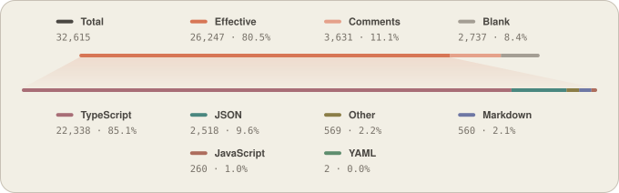
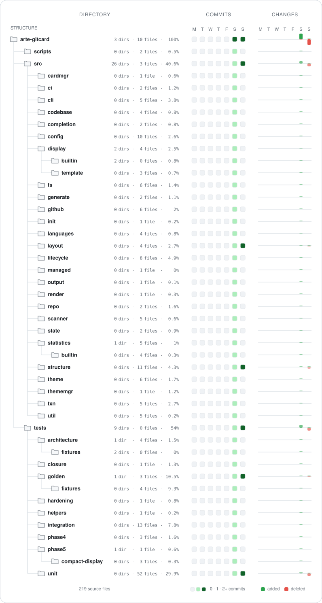

# arte-gitcard

When you come across an unfamiliar project, you usually don't start reading the code right away. First you size it up: what does the code mostly consist of, where does the directory tree begin to unfold, and where are recent changes concentrated? Those answers already live in the repository, but scattered across the file tree, the language statistics, and the commit history. Keeping them by hand tends to go stale; once the README drifts out of sync with the code, it can no longer serve as a reliable point of entry.

`arte-gitcard` hands these scattered pieces of information back to the repository itself: it renders visual Cards from the code and Git history so they can be used in the README or other documentation. You can generate them manually for a specific branch and sync the result with Git, or have them updated automatically on the repository's default branch in GitHub.

## Card

### Codebase

<p style="text-align: center;">
  
</p>

The Codebase card splits the repository's code into `Effective`, `Comments`, and `Blank`, and reports how much each language contributes to the counted source code. Language detection supports both built-in rules and your own custom rules. `codebase.include-comments` decides whether comment lines count toward the language shares; the total-line breakdown at the top always shows effective code, comments, and blank lines separately.

### Structure

<p style="text-align: center;">
  
</p>

The Structure card renders the repository tree from a configurable directory root. Each row can show:

- the number of immediate subdirectories
- the number of immediate files
- that directory subtree's share of the repository's counted source code
- an optional directory description
- commit activity within the given time window
- file additions and deletions

Structure presents the repository layout itself; architectural relationships, protocol boundaries, and module responsibilities can still be described separately in the README whenever a project needs to.

### Developer reference

Run the full test suite from the source repository:

```bash
npx -y pnpm@11.24.0 typecheck
npx -y pnpm@11.24.0 build
npx -y pnpm@11.24.0 verify-dist
npx -y pnpm@11.24.0 test
```

## Building

Requirements:

| Project | Requirement |
|---|---|
| Node.js | `>= 20` |
| pnpm | `11.24.0` |
| Git | Required for GitHub auto-update |

Dependencies are locked by pnpm-lock.yaml; use the pinned pnpm version and `--frozen-lockfile` for a reproducible install.

Build from source:

```bash
git clone <repository-url>
cd arte-gitcard

npx -y pnpm@11.24.0 install --frozen-lockfile
npx -y pnpm@11.24.0 build

node dist/cli.js --version
```

The built CLI is:

```text
dist/cli.js
```

You can run it directly by its absolute path:

```bash
node /path/to/arte-gitcard/dist/cli.js --help
```

The rest of this document uses `arte-gitcard` as the command name. You can define it as a local shell function.

PowerShell:

```powershell
function arte-gitcard {
    node "C:\path\to\arte-gitcard\dist\cli.js" @args
}
```

Bash / Zsh:

```bash
arte-gitcard() {
  node /path/to/arte-gitcard/dist/cli.js "$@"
}
```

You can also install it as a system command:

```bash
npm link
```

## Quick start

Go to the repository you want to generate Cards for:

```bash
cd /path/to/your/repository
```

Initialize:

```bash
arte-gitcard init
```

By default this creates:

```text
.github/arte-git-card/codebase.svg
.github/arte-git-card/structure.svg
```

Get the README snippet:

```bash
arte-gitcard snippet
```

The output can be dropped straight into the README:

```markdown


```

Regenerate after changing configuration or directory descriptions:

```bash
arte-gitcard generate
```

If the generated content is unchanged, existing SVGs are not rewritten.

Check status:

```bash
arte-gitcard status
```

Run a full read-only diagnostic:

```bash
arte-gitcard doctor
```

## Configuration

Project configuration is stored in:

```text
arte-gitcard.yml
```

`arte-gitcard.yml` can be edited by hand, but the **arte-gitcard CLI** is the recommended way to manage configuration day to day. The CLI picks the right operation for each config type and validates before writing; editing the YAML directly is bound by the same strict validation.

Recommended:

```bash
arte-gitcard config list
arte-gitcard config get structure.max-depth
arte-gitcard config set structure.max-depth 4
arte-gitcard config reset structure.max-depth
```

After editing the YAML by hand, you can check it first:

```bash
arte-gitcard validate
```

Unknown fields, wrong types, invalid paths, and invalid values are all rejected.

Current configuration schema:

```yaml
schema-version: 2
```

### Configuration key reference

`arte-gitcard config list` lists the typed keys the CLI can manage, together with their types and current values. Some lifecycle configuration is managed by its own dedicated commands rather than `config set`.

| CLI key | YAML location | Type / allowed values | Default | Recommended way to change | Purpose |
|---|---|---|---|---|---|
| `schema-version` | `schema-version` | fixed integer | `2` | managed by `migrate` | Configuration schema version |
| `codebase.enabled` | `cards.codebase.enabled` | boolean | `true` | `add codebase` / `remove codebase` | Enable or disable the Codebase card |
| `codebase.include-comments` | `cards.codebase.languages.include_comments` | boolean | `false` | `config set/reset` | Whether comment lines count toward the language shares |
| `structure.enabled` | `cards.structure.enabled` | boolean | `true` | `add structure` / `remove structure` | Enable or disable the Structure card |
| `structure.root` | `cards.structure.root` | project-relative directory | `"."` | `config set/reset` | Directory root of the Structure card |
| `structure.max-depth` | `cards.structure.max_depth` | integer `1..5` | `3` | `config set/reset` | Display depth; the repository root is level 0 and does not count against this depth |
| `structure.activity-days` | `cards.structure.activity_days` | `7` / `14` / `30` | `7` | `config set/reset` | Length of the Git activity window in days |
| `structure.activity-anchor` | `cards.structure.activity_anchor` | `recent` / `last-activity` | `recent` | `config set/reset` | End date of the activity window |
| `structure.commits.enabled` | `cards.structure.commits.enabled` | boolean | `true` | `config set/reset` | Show the commit heatmap |
| `structure.changes.enabled` | `cards.structure.changes.enabled` | boolean | `true` | `config set/reset` | Show file add/delete microbars |
| `languages[]` | `languages` | language rule array | empty | `language ...` | Define custom language detection rules or override built-in ones |
| `exclude[]` | `exclude` | string array | see default exclusions below | `exclude ...` | Scan exclusion rules |
| `theme` | `theme` | installed theme path | `.arte-git-card/themes/arte-theme.yml` | `theme select` | Current theme |
| `output.directory` | `output.directory` | safe project-relative path | `.github/arte-git-card` | `config set/reset` | Card output directory |
| `auto-update` | `auto-update` | boolean | `false` | `github enable/disable` | Auto-update on the GitHub default branch |

`structure.activity-anchor`:

| Value | Meaning |
|---|---|
| `recent` | The window ends today |
| `last-activity` | The window ends on the calendar day of the repository's most recent commit |

### CLI configuration usage

View everything that can be managed:

```bash
arte-gitcard config list
```

Read:

```bash
arte-gitcard config get structure.max-depth
```

Change:

```bash
arte-gitcard config set structure.max-depth 4
arte-gitcard config set structure.activity-days 30
arte-gitcard config set structure.activity-anchor last-activity
arte-gitcard config set codebase.include-comments true
```

Restore a default value:

```bash
arte-gitcard config reset structure.activity-days
```

Show the configuration file path:

```bash
arte-gitcard config path
```

`config set` is for tuning keys. The following configuration is managed through dedicated commands:

| Configuration | Command |
|---|---|
| Codebase enabled state | `arte-gitcard add codebase` / `arte-gitcard remove codebase` |
| Structure enabled state | `arte-gitcard add structure` / `arte-gitcard remove structure` |
| Scan exclusions | `arte-gitcard exclude ...` |
| Custom languages | `arte-gitcard language ...` |
| Structure directory descriptions | `arte-gitcard structure ...` |
| Theme | `arte-gitcard theme ...` |
| GitHub auto-update | `arte-gitcard github ...` |

### YAML reference

If you need to edit `arte-gitcard.yml` directly, the full user-facing configuration surface of the current schema is below. Hand-editing is supported, but the CLI is the recommended approach.

```yaml
schema-version: 2

cards:
  codebase:
    enabled: true
    languages:
      include_comments: false

  structure:
    enabled: true
    root: "."
    max_depth: 3
    activity_days: 7
    activity_anchor: "recent"
    commits:
      enabled: true
    changes:
      enabled: true

languages: []

exclude:
  - node_modules
  - vendor
  - dist
  - build
  - coverage
  - .next
  - .nuxt
  - target
  - out
  - .cache
  - .github
  - package-lock.json
  - yarn.lock
  - pnpm-lock.yaml
  - composer.lock
  - Cargo.lock
  - Gemfile.lock
  - go.sum
  - poetry.lock
  - "*.min.js"
  - "*.min.css"
  - "*.map"
  - "*.lock"

theme: ".arte-git-card/themes/arte-theme.yml"

output:
  directory: ".github/arte-git-card"

auto-update: false
```

When `activity_anchor` is omitted, `recent` is used. `languages` may be empty.

After editing the YAML directly, it is recommended to run:

```bash
arte-gitcard validate
arte-gitcard generate
```

## Scan exclusions

View the current user exclusions:

```bash
arte-gitcard exclude list
```

Manage exclusions:

```bash
arte-gitcard exclude add generated
arte-gitcard exclude remove generated
arte-gitcard exclude reset
```

Default user exclusions:

| Type | Defaults |
|---|---|
| Directories | `node_modules`, `vendor`, `dist`, `build`, `coverage`, `.next`, `.nuxt`, `target`, `out`, `.cache`, `.github` |
| Lockfiles | `package-lock.json`, `yarn.lock`, `pnpm-lock.yaml`, `composer.lock`, `Cargo.lock`, `Gemfile.lock`, `go.sum`, `poetry.lock` |
| File suffix rules | `*.min.js`, `*.min.css`, `*.map`, `*.lock` |

There are also tool-level exclusions that cannot be undone with `exclude remove`, covering Git metadata, arte-gitcard's own configuration/state directories, the current output directory, and managed workflows, among others.

## Language rules

View languages:

```bash
arte-gitcard language list
arte-gitcard language show python
```

Current built-in language ids:

| ID | ID | ID | ID |
|---|---|---|---|
| `typescript` | `javascript` | `python` | `rust` |
| `go` | `shell` | `java` | `c` |
| `cpp` | `csharp` | `ruby` | `php` |
| `swift` | `kotlin` | `html` | `css` |
| `markdown` | `json` | `yaml` | `toml` |
| `sql` | `dockerfile` | `makefile` | `cmake` |

Add a custom language:

```bash
arte-gitcard language add mylang \
  --name "My Language" \
  --extensions ".foo,.bar" \
  --filenames "Myfile" \
  --shebang "mylang" \
  --line-comment "//" \
  --block-comment "/*,*/"
```

`language add` can introduce a new id, or override an existing language rule under the same id.

### `language add` arguments

| Argument | Required | Format | Purpose |
|---|---:|---|---|
| `<id>` | yes | non-empty string | Language id |
| `--name <name>` | yes | non-empty string | Display name |
| `--extensions <list>` | no | comma-separated | File extensions |
| `--filenames <list>` | no | comma-separated | Exact filenames |
| `--shebang <list>` | no | comma-separated | Shebang program |
| `--line-comment <marker>` | no | single non-empty marker | Line comment marker |
| `--block-comment <pair>` | no | `start,end` | Block comment open/close markers |

Remove a custom language:

```bash
arte-gitcard language remove mylang
```

Built-in languages cannot be removed with `language remove`.

## Structure directory descriptions

Add a short description to a directory:

```bash
arte-gitcard structure describe src "Core source"
```

View the current Structure tree and descriptions:

```bash
arte-gitcard structure list
arte-gitcard structure list 5
```

Remove a description:

```bash
arte-gitcard structure remove src
```

Rules:

| Item | Rule |
|---|---|
| Path base | Relative to `structure.root` |
| Path spelling | Accepts `src`, `./src`, `src/`, `src\components`, etc., and normalizes them |
| Description length | At most 20 Unicode code points |
| Forbidden content | Tabs, newlines, and characters illegal in XML |
| Metadata file | `.arte-git-card/structure-descriptions.json` |
| Triggers generation? | `describe` / `remove` only change metadata; they do not generate Cards automatically |
| Refresh SVGs | Run `arte-gitcard generate` after editing descriptions |
| Vanished directories | Descriptions for directories that no longer exist are cleaned up during the relevant operations/generation |

## Themes

Built-in presets:

| Name | Description |
|---|---|
| `arte-theme` | Default theme |
| `github-theme` | GitHub-styled theme |

Common commands:

```bash
arte-gitcard theme list
arte-gitcard theme install github-theme
arte-gitcard theme select github-theme
arte-gitcard theme show github-theme
```

You can also install a local YAML:

```bash
arte-gitcard theme validate ./my-theme.yml
arte-gitcard theme install ./my-theme.yml
arte-gitcard theme select my-theme
```

A theme YAML may override only the fields you want to change; omitted fields fall back to the defaults from `arte-theme`. Unknown fields are rejected.

### Color formats

| Location | Supported formats |
|---|---|
| `palette.*` | `#RGB` / `#RRGGBB` |
| `palette.data_palette.families[].base` | `#RGB` / `#RRGGBB` |
| Codebase / Structure component color ref | palette token, or `#RGB` / `#RRGGBB` / `#RRGGBBAA` |
| opacity | `0..1` |

Built-in palette tokens usable as a component color ref:

`surface`, `surface_muted`, `text`, `text_muted`, `border_muted`, `divider`, `accent`, `accent_soft`, `neutral`, `positive`, `negative`

### Theme field reference

| Field | Type / constraint | Purpose |
|---|---|---|
| `name` | string, optional | Theme name |
| `palette.surface` | concrete hex | Card background |
| `palette.surface_muted` | concrete hex | Secondary background |
| `palette.text` | concrete hex | Primary text |
| `palette.text_muted` | concrete hex | Secondary text |
| `palette.border_muted` | concrete hex | Faint border |
| `palette.divider` | concrete hex | Divider |
| `palette.accent` | concrete hex | Primary accent |
| `palette.accent_soft` | concrete hex | Secondary accent |
| `palette.neutral` | concrete hex | Neutral color |
| `palette.positive` | concrete hex | Positive / additions |
| `palette.negative` | concrete hex | Negative / deletions |
| `palette.data_palette.families` | exactly 12 items | Data color families |
| `palette.data_palette.families[].name` | non-empty string | Family display name |
| `palette.data_palette.families[].base` | concrete hex | Family base color |
| `style.card.radius` | number `>= 0` | Card corner radius |
| `style.card.border_width` | number `>= 0` | Card border width |
| `style.bar.radius` | number `>= 0` | Bar corner radius |
| `style.heatmap.radius` | number `>= 0` | Heatmap cell corner radius |
| `codebase.effective` | color ref | Effective color |
| `codebase.comments` | color ref | Comments color |
| `codebase.blank` | color ref | Blank color |
| `codebase.languages.color_mode` | `palette` / `monochrome` | Language color mode |
| `codebase.fan.color` | color ref | Codebase fan color |
| `codebase.fan.fill_opacity.start` | `0..1` | Fan start opacity |
| `codebase.fan.fill_opacity.end` | `0..1` | Fan end opacity |
| `codebase.fan.edge_stroke_opacity` | `0..1` | Fan edge stroke opacity |
| `structure.tree` | color ref | Tree connector color |
| `structure.folder.fill` | color ref | Folder fill |
| `structure.folder.stroke` | color ref | Folder stroke |
| `structure.commits.colors` | 5 color refs | Colors of the commit heatmap's 5 levels |
| `structure.commits.intensity` | 5 × `0..1` | Intensity of the commit heatmap's 5 levels |
| `structure.commits.border` | color ref | Heatmap cell border |
| `structure.changes.added` | color ref | Additions |
| `structure.changes.deleted` | color ref | Deletions |
| `structure.changes.baseline` | color ref | Changes baseline |
| `structure.changes.opacity` | 4 × `0..1`, optional | Intensity ramp of the changes bars |

A minimal example theme that overrides a few fields:

```yaml
name: my-theme

palette:
  accent: "#7C5CFC"

codebase:
  languages:
    color_mode: monochrome

structure:
  changes:
    added: positive
    deleted: negative
```

## GitHub auto-update

Enable:

```bash
arte-gitcard github enable
```

This command writes the files needed for the GitHub integration locally and targets the repository's **default branch** for updates. It does not run `git commit`, `git push`, or switch branches for you.

Review the changes and commit them yourself:

```bash
git add .
git commit -m "Enable arte-gitcard"
git push
```

From then on, whenever the default branch is updated, the workflow regenerates the enabled Cards and writes a bot commit when the content has changed.

### GitHub commands

| Command | Purpose |
|---|---|
| `arte-gitcard github enable` | Enable default-branch auto-update |
| `arte-gitcard github disable` | Disable auto-update |
| `arte-gitcard github sync` | Re-sync the workflow, vendored CI runtime, and state to the current default branch |
| `arte-gitcard github status` | View integration status |

Usage constraints:

| Item | Behavior |
|---|---|
| Local `generate` | Runs on any checkout; never switches branches, commits, or pushes |
| GitHub write-back target | Repository default branch |
| Default branch source | The authoritative default branch from the Git remote; the current checkout is not used as a stand-in |
| Workflow token | GitHub `GITHUB_TOKEN` |
| Force push | Never used |
| Pull / merge / rebase fallback | Not used |
| Push rejected by rulesets / branch protection | Fails directly; repository policy is not bypassed |
| CI runtime | The workflow verifies the integrity of the managed runtime before executing |
| Default branch renamed | Run `arte-gitcard github sync` |

## Full command reference

The following covers every public CLI command. Internal dynamic-completion entry points are not listed as user commands.

### Repository / Card

| Command | Specific arguments | Purpose |
|---|---|---|
| `arte-gitcard help [command]` | — | Show help for a command |
| `arte-gitcard init` | — | Initialize configuration, the default theme, state, and the default Cards |
| `arte-gitcard reset` | `--yes` | Reset arte-gitcard configuration and managed artifacts |
| `arte-gitcard migrate` | — | Migrate legacy v1 configuration to schema v2 |
| `arte-gitcard uninstall` | `--yes` | Safely remove arte-gitcard artifacts that can be proven owned and unmodified |
| `arte-gitcard status` | — | Show the state of the repository, Cards, theme, and managed artifacts |
| `arte-gitcard doctor` | — | Full read-only diagnostic; does not auto-fix |
| `arte-gitcard validate` | — | Validate the configuration, theme, output path, and directory-description metadata |
| `arte-gitcard generate` | `--preview` | Generate all enabled Cards; `--preview` also writes `preview.html` |
| `arte-gitcard add [card]` | `-a, --all` | Enable and generate the given Card, or enable them all |
| `arte-gitcard remove [card]` | `-a, --all` | Disable the given Card, or disable them all; deletes only SVGs that can be proven owned and unmodified |
| `arte-gitcard snippet [card]` | — | Print README Markdown snippets; does not modify the README |
| `arte-gitcard card list` | — | Show each Card's enabled state, output path, and ownership status |

Available Card ids:

| ID | Output file |
|---|---|
| `codebase` | `codebase.svg` |
| `structure` | `structure.svg` |

### Config

| Command | Purpose |
|---|---|
| `arte-gitcard config list` | List every typed config key with its type, kind, and current value |
| `arte-gitcard config get <key>` | Read a config value |
| `arte-gitcard config set <key> <value>` | Change a tuning key |
| `arte-gitcard config reset <key>` | Restore a tuning key to its default |
| `arte-gitcard config path` | Print the current `arte-gitcard.yml` path |

### Exclude

| Command | Purpose |
|---|---|
| `arte-gitcard exclude list` | View user exclusions |
| `arte-gitcard exclude add <pattern>` | Add a scan exclusion rule |
| `arte-gitcard exclude remove <pattern>` | Remove a scan exclusion rule |
| `arte-gitcard exclude reset` | Restore the default exclusions |

### Language

| Command | Specific arguments | Purpose |
|---|---|---|
| `arte-gitcard language list` | — | List built-in and custom languages |
| `arte-gitcard language show <id>` | — | View a language rule |
| `arte-gitcard language add <id>` | `--name <name>` required; `--extensions <list>`, `--filenames <list>`, `--shebang <list>`, `--line-comment <marker>`, `--block-comment <pair>` optional | Add or override a custom language rule |
| `arte-gitcard language remove <id>` | — | Remove a custom language; built-in languages cannot be removed |

### Structure

| Command | Purpose |
|---|---|
| `arte-gitcard structure list [depth]` | Display the Structure tree and directory descriptions read-only; when `depth` is omitted, `structure.max-depth` is used |
| `arte-gitcard structure describe <path> <description>` | Set or update a directory description; does not generate Cards automatically |
| `arte-gitcard structure remove <path>` | Remove a directory description; does not generate Cards automatically |

### Theme

| Command | Purpose |
|---|---|
| `arte-gitcard theme list` | View installed themes, the current theme, and installable presets |
| `arte-gitcard theme install <file>` | Install a local YAML, or install the `arte-theme` / `github-theme` preset |
| `arte-gitcard theme select <name>` | Select a theme and regenerate the enabled Cards |
| `arte-gitcard theme show <name>` | Print the YAML of an installed theme or preset |
| `arte-gitcard theme validate <file>` | Validate a theme YAML; partial overrides are supported |
| `arte-gitcard theme remove <name>` | Remove an installed theme that is not currently selected; modified files are kept |

### GitHub

| Command | Purpose |
|---|---|
| `arte-gitcard github enable` | Enable default-branch auto-update |
| `arte-gitcard github disable` | Disable auto-update |
| `arte-gitcard github sync` | Align the default branch, workflow, vendored CI runtime, and state; only makes local writes |
| `arte-gitcard github status` | View GitHub integration status |

### Completion

| Command | Purpose |
|---|---|
| `arte-gitcard completion bash` | Print the Bash completion script |
| `arte-gitcard completion zsh` | Print the Zsh completion script |
| `arte-gitcard completion fish` | Print the Fish completion script |
| `arte-gitcard completion powershell` | Print the PowerShell completion script |

## Global options

These options are registered on the public command hierarchy and can be used with each command as applicable.

| Option | Purpose |
|---|---|
| `-h, --help` | Show help for the current command / command group |
| `-v, --version` | Show the version |
| `--repo <path>` | Run against the given project directory instead of the current one |
| `--json` | Print machine-readable JSON to stdout |
| `--quiet` | Suppress ordinary informational output |
| `--verbose` | Print verbose diagnostics |
| `--no-color` | Disable ANSI colors |
| `--dry-run` | Validate and report the plan without performing any file writes |

Examples:

```bash
arte-gitcard --repo ../my-project status
arte-gitcard config list --json
arte-gitcard github sync --dry-run
arte-gitcard generate --verbose
```

## Managed files

Files commonly present after initialization:

| Path | Contents |
|---|---|
| `arte-gitcard.yml` | Main configuration |
| `.arte-git-card/state.json` | Ownership / managed state |
| `.arte-git-card/themes/arte-theme.yml` | Default materialized theme |
| `.github/arte-git-card/codebase.svg` | Codebase |
| `.github/arte-git-card/structure.svg` | Structure |

May appear depending on the features in use:

| Path | When it appears |
|---|---|
| `.arte-git-card/structure-descriptions.json` | After adding Structure directory descriptions |
| `.github/arte-git-card/preview.html` | `generate --preview` |
| `.github/workflows/arte-gitcard.yml` | `github enable` |
| `.arte-git-card/ci/action.yml` | `github enable` |
| `.arte-git-card/ci/main.cjs` | `github enable` |

Don't hand-delete managed state instead of `reset`, `remove`, `github disable`, or `uninstall`. To confirm the current state, use:

```bash
arte-gitcard status
arte-gitcard doctor
```

## License

`arte-gitcard` is licensed under **GNU General Public License v3.0 only**:

```text
GPL-3.0-only
```

The full license, disclaimer of warranty, and limitation of liability are set out in [`LICENSE`](LICENSE).
